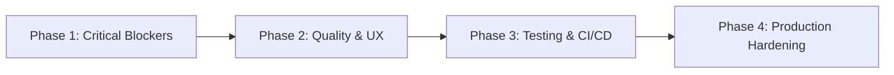

# TNA Platform — Production Readiness Remediation Plan

**Version:** 1.0 · **Date:** 2026-05-12 · **Target Branch:** `feature/production-readiness`

This plan addresses all gaps identified in the production readiness audit to achieve full deployment readiness.

---

## Executive Summary

This remediation plan sequences critical fixes into a **4-phase pipeline** that resolves blocking issues first, followed by quality enhancements, testing infrastructure, and production hardening.



---

## Phase 1 — Critical Blockers Resolution (Days 1-2)

> **Goal:** Eliminate all blockers preventing core user flows (Gov queue detail, Profile access, i18n consistency).

### 1A. Gov TNA Queue Detail Page (Critical)
**Problem:** 404 on `/[locale]/gov/tna-queue/[id]` due to missing dynamic route.
**Solution:**
- Create `src/app/[locale]/gov/tna-queue/[id]/page.tsx`
- Implement detail view using `mockGovQueue` data
- Import `AppShell` with `role="Gov"`
- Acceptance: Navigating to `/ar/gov/tna-queue/req-pending-1` renders detail view

### 1B. i18n Inline String Elimination (Critical)
**Problem:** 34 remaining `isRTL ? '...' : '...'` patterns causing localization breaks.
**Solution:**
1. Extract all inline strings to `src/lib/i18n/{ar,en}.json`
2. Replace with `t('key.path')` calls
3. Remove unused `isRTL` destructuring
4. Validation: Zero `isRTL ?` patterns remain (automated test)
5. Priority order: Gov (10 files) → Owner (7) → Carrier (8) → Visitor (5) → Auth (3) → Shell (3)

### 1C. Profile Page Creation (High)
**Problem:** Missing profile pages for Owner/Carrier/Gov roles cause 404s from Header/Sidebar.
**Solution:**
- Create `src/app/[locale]/owner/profile/page.tsx`
- Create `src/app/[locale]/carrier/page/page.tsx`
- Create `src/app/[locale]/gov/profile/page.tsx`
- Each wraps `<ProfileModule role="RoleName" />`
- Acceptance: Sidebar Profile links navigate correctly for all roles

### 1D. Header SearchBar Removal (High)
**Problem:** SearchBar violates Phase 2 refactor requirements.
**Solution:**
- Remove desktop `<form>` (Header.tsx lines 114-126)
- Remove mobile search bar (Header.tsx lines 181-193)
- Remove `shouldShowSearch` logic, `searchQuery` state, `handleSearch`
- Remove `MagnifyingGlass` import
- Acceptance: Header shows only LanguageSwitcher, NotificationBell, UserAvatar, WalletBalanceChip

---

## Phase 2 — Quality & UX Enhancements (Days 3-4)

> **Goal:** Complete visual refactoring, dashboard interactivity, and mobile responsiveness.

### 2A. Sidebar Visual Theme Overhaul (High)
**Problem:** Still using outdated `bg-primary-gradient` instead of professional dark theme.
**Solution:**
- Define CSS custom properties in `src/app/globals.css`:
  ```css
  :root {
    --sidebar-gradient: linear-gradient(180deg, #0a1628 0%, #112240 50%, #0d1b3a 100%);
    --sidebar-text-primary: #e2e8f0;
    --sidebar-text-secondary: #94a3b8;
    --sidebar-text-muted: #64748b;
    --sidebar-active-bg: rgba(255, 255, 255, 0.08);
    --sidebar-active-border: #38bdf8;
    --sidebar-hover-bg: rgba(255, 255, 255, 0.04);
  }
  ```
- Apply to `RoleSidebar.tsx` and mobile sidebar in `AppShell.tsx`
- Replace `bg-primary-gradient` with `bg-[color:var(--sidebar-gradient)]`
- Implement active/hover states using new variables
- Acceptance: Sidebar matches spec visual theme

### 2B. Dashboard Interactivity Completion (Medium)
**Problem:** Carrier dashboard missing fleet utilization chart; Gov needs enhanced region cards.
**Solution:**
- **CarrierHomeModule.tsx:**
  - Add interactive progress bars for fleet utilization using `mockFleetUtilization`
  - Implement animated task distribution visualization
  - Make map buttons navigate to placeholder pages (`/carrier/map`, `/carrier/live-map`)
- **GovHomeModule.tsx:**
  - Enhance region cards with trend arrows and tooltips
  - Add interactive elements to region grid
- Acceptance: All role home modules have interactive, data-driven widgets

### 2C. Auth Responsivity Fix (Medium)
**Problem:** Login page geometric patterns cause visual clutter on mobile.
**Solution:**
- Implement breakpoint-based styling in `LoginPage.tsx`:
  - `< 640px`: Hide geometric patterns, full-width card, `px-4`
  - `640px–1024px`: `max-w-[520px]`, subtle patterns at reduced opacity
  - `> 1024px`: `max-w-[480px]` + full geometric patterns
- Apply same pattern to `RegistrationModule.tsx` and `ForgotPasswordModule.tsx`
- Acceptance: Clean mobile auth experience without visual clutter

### 2D. Payment i18n Completion (Low)
**Problem:** Some hardcoded English strings in checkout flow.
**Solution:**
- Audit `CheckoutModule.tsx` and `CheckoutOrderSummary.tsx`
- Move remaining strings to locale files
- Replace with `t()` calls
- Acceptance: Zero hardcoded English strings in payment flow

---

## Phase 3 — Testing & CI/CD Infrastructure (Days 5-6)

> **Goal:** Establish automated confidence across roles, locales, and viewports.

### 3A. Playwright Test Suite Setup (Critical)
**Problem:** Zero end-to-end test coverage.
**Solution:**
- Install: `npm install -D @playwright/test`
- Initialize: `npx playwright install`
- Create `playwright.config.ts` with `baseURL: http://localhost:3000`
- Implement test architecture:
  ```
  tests/
  ├── e2e/
  │   ├── auth/
  │   │   ├── login.spec.ts
  │   │   ├── register.spec.ts
  │   │   └── forgot-password.spec.ts
  │   ├── visitor/
  │   │   ├── home.spec.ts
  │   │   ├── checkout.spec.ts
  │   │   └── tna-flow.spec.ts
  │   ├── owner/
  │   │   ├── home.spec.ts
  │   │   └── properties.spec.ts
  │   ├── carrier/
  │   │   └── home.spec.ts
  │   └── gov/
  │       ├── home.spec.ts
  │       └── tna-queue.spec.ts
  ├── i18n/
  │   ├── locale-switching.spec.ts
  │   └── rtl-layout.spec.ts
  └── responsive/
      └── viewport-matrix.spec.ts
  ```
- Acceptance: All test suites pass in CI

### 3B. CI Pipeline Implementation (Critical)
**Problem:** No automated testing or deployment verification.
**Solution:**
- Create `.github/workflows/test.yml`:
  ```yaml
  name: E2E Tests
  on: [push, pull_request]
  jobs:
    test:
      runs-on: ubuntu-latest
      steps:
        - uses: actions/checkout@v4
        - uses: actions/setup-node@v4
          with: { node-version: 20 }
        - run: npm ci
        - run: npx playwright install --with-deps
        - run: npm run build
        - run: npx playwright test
        - uses: actions/upload-artifact@v4
          if: failure()
          with:
            name: playwright-report
            path: playwright-report/
  ```
- Acceptance: Pipeline runs on all PRs and pushes

### 3C. Unit & Integration Test Enhancement (Medium)
**Problem:** Limited test coverage beyond basic vitest setup.
**Solution:**
- Increase coverage for:
  - Custom hooks (`useWallet`, `useUIStore`)
  - Context providers (`BindingContext`, `AuthContext`)
  - Utility functions (Luhn validation, date formatting)
  - Components with complex logic (Header, RoleSidebar)
- Acceptance: 80%+ line coverage reported by vitest

---

## Phase 4 — Production Hardening (Days 7-8)

> **Goal:** Ensure security, performance, and operational readiness.

### 4A. Security Hardening (High)
**Problem:** Potential vulnerabilities in dependencies and configuration.
**Solution:**
- Run `npm audit` and fix high/critical vulnerabilities
- Implement Content Security Policy headers in `next.config.js`
- Add rate limiting middleware for auth endpoints
- Ensure all API calls use HTTPS in production
- Validate environment variables aren't exposed in client bundles
- Acceptance: Clean security scan, no high/critical vulnerabilities

### 4B. Performance Optimization (Medium)
**Problem:** Potential bundle size and hydration issues.
**Solution:**
- Analyze bundle with `next-bundle-analyzer`
- Implement dynamic imports for heavy components
- Optimize image loading with Next.js Image component
- Ensure proper caching headers for static assets
- Acceptance: Lighthouse score >90 for Performance, Accessibility, Best Practices

### 4C. Monitoring & Observability (Medium)
**Problem:** Lack of production observability.
**Solution:**
- Implement error tracking (Sentry or similar)
- Add performance monitoring (Web Vitals)
- Create health check endpoints
- Structure logging for production debugging
- Acceptance: Basic observability stack functional in staging

### 4D. Release Management Framework (High)
**Problem:** No formal deployment or rollback procedures.
**Solution:**
- Create deployment checklist:
  - [ ] Pre-deploy: Run full test suite
  - [ ] Pre-deploy: Verify bundle size < threshold
  - [ ] Deploy: Blue-green or rolling update strategy
  - [ ] Post-deploy: Smoke test critical paths
  - [ ] Post-deploy: Monitor error rates for 15min
  - [ ] Rollback: Automated on health check failure
- Create rollback playbook:
  - Instant rollback via CI/CD
  - Manual rollback procedures
  - Data migration safeguards
- Acceptance: Documented, tested release process

---

## Success Criteria & Exit Gates

### Phase 1 Exit Gate (End of Day 2)
- ✅ Gov TNA queue detail page renders without 404
- ✅ Zero `isRTL ?` patterns remaining in codebase
- ✅ All profile pages accessible via Header/Sidebar
- ✅ Header SearchBar completely removed
- ✅ Manual QA: Core flows (login → gov queue → detail → back) work

### Phase 2 Exit Gate (End of Day 4)
- ✅ Sidebar matches professional dark theme specification
- ✅ All role home modules have interactive data visualizations
- ✅ Auth pages responsive and clean on mobile
- ✅ Payment flow fully internationalized
- ✅ Manual QA: All role home pages functional and visually correct

### Phase 3 Exit Gate (End of Day 6)
- ✅ Playwright test suite passes locally
- ✅ CI pipeline runs tests on every push/PR
- ✅ Test coverage >80% for unit/integration tests
- ✅ Manual QA: Critical user paths tested via E2E

### Phase 4 Exit Gate (End of Day 8)
- ✅ Security scan shows no high/critical vulnerabilities
- ✅ Lighthouse performance score >90
- ✅ Monitoring/alerting configured in staging
- ✅ Release management framework documented and tested
- ✅ Final QA: Production-like environment validation

---

## Resource Allocation

**Team:** 1 Full-Stack Engineer (8 days)
**Daily Capacity:** 6 productive hours/day
**Buffer:** 20% for unexpected complexity

| Phase | Effort | Dependencies |
|-------|--------|--------------|
| Phase 1: Critical Blockers | 2 days | None |
| Phase 2: Quality & UX | 2 days | Phase 1 (i18n done first) |
| Phase 3: Testing & CI/CD | 2 days | Phase 2 (stable UI) |
| Phase 4: Production Hardening | 2 days | Phase 3 (tests passing) |
| **Total** | **8 days** | Linear progression |

---

## Risk Mitigation

| Risk | Mitigation |
|------|------------|
| i18n extraction misses edge cases | Automated grep validation in Phase 1 exit gate |
| Sidebar collapse breaks mobile overlay | Test both states at every viewport in Playwright suite |
| Gov detail page mock data mismatch | Verify `request_id` format between mock and router |
| Payment mock gives false confidence | Add "DEMO MODE" banner in development |
| Test suite flakiness | Use `testId` attributes, avoid timing-dependent selectors |
| Performance regressions | Bundle analysis in Phase 4, performance budgets |

---

## Rollback & Contingency Procedures

### Immediate Rollback (<5min)
- Trigger via CI/CD pipeline manual approval
- Revert to previous stable deployment
- Validate health checks pass

### Hotfix Procedure
1. Create hotfix branch from production tag
2. Implement fix with minimal changes
3. Run full test suite
4. Deploy via emergency pipeline
5. Monitor for 30min post-deploy

### Data Migration Safety
- All changes are UI-only, no schema modifications
- Mock data unaffected
- No persistent state changes introduced

---

## Approval & Next Steps

**Immediate Action:** Begin Phase 1A — Create `src/app/[locale]/gov/tna-queue/[id]/page.tsx`

**Daily Check-ins:** Brief status update at end of each day
**Blocking Issues:** Escalate immediately if Phase 1 exit gate not met by EOD Day 2

**Final Validation:** Production readiness sign-off requires:
- All exit gate criteria met
- Stakeholder demo of core flows
- Security and performance review approval